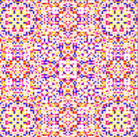
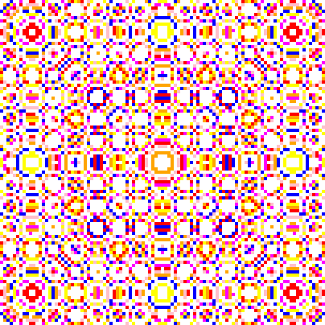
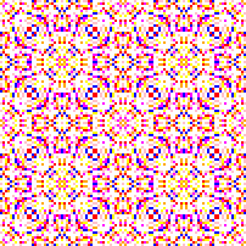
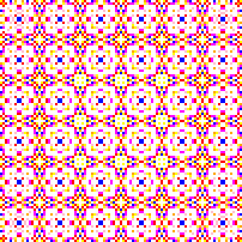
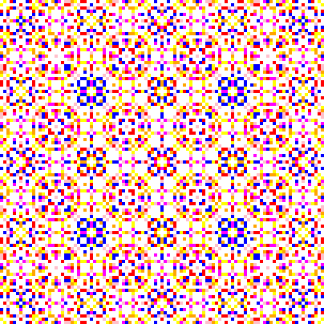
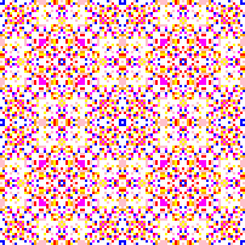
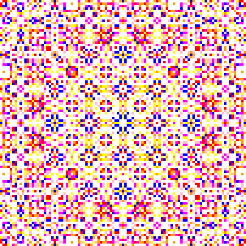
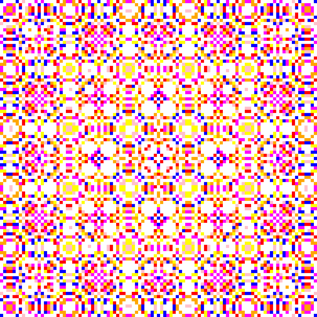
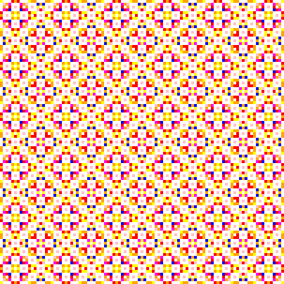

# Moire Tapestry - Generative art in 1986

(All patterns are generated from just one parameter without randomness.)

   
   

Interactive & colorized version of the article:

> A. K. Dewdney: "COMPUTER RECREATIONS", Scientific American, Vol. 255, No. 3, pp. 14-23, September 1986.

> ("Wallpaper for the mind: computer images that are almost, but not quite, repetitive")

[Demo, Algorithm, Samples](http://kaorahi.github.io/moireTapestry/moire.html)
